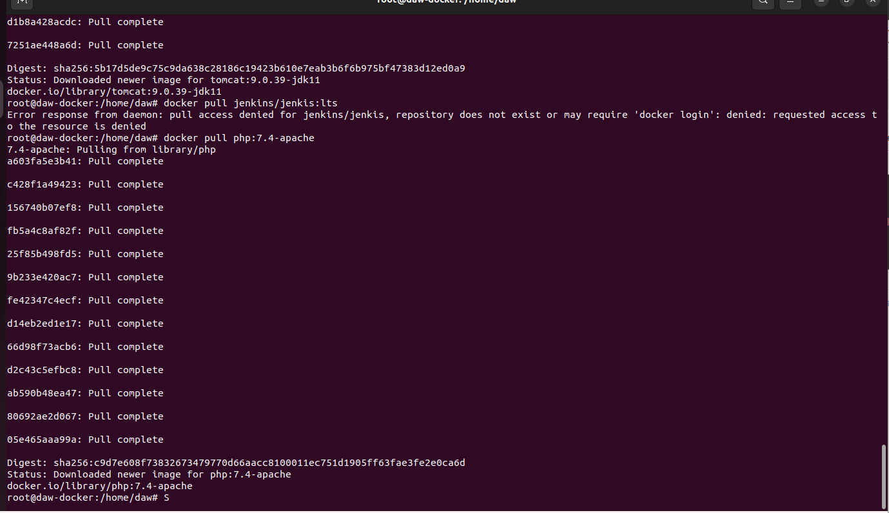
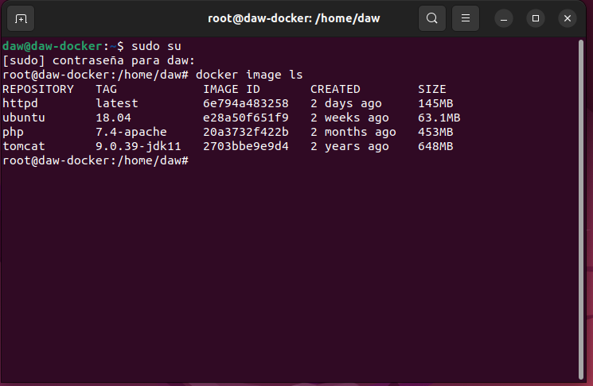

# Ejercicios Docker 2
> Realizado por: Emilio Taibo

- Descarga las siguientes imágenes: ubuntu:18.04, httpd, tomcat:9.0.39-jdk11,jenkins/jenkins:lts, php:7.4-apache.

~~~
docker pull ubuntu:18.04
docker pull httpd
docker pull tomcat:9.0.39-jdk11
docker pull jenkins/jenkins:lts
docker pull php:7.4-apache
~~~

- Muestras las imágenes que tienes descargadas.
~~~
docker image ls
~~~

- Crea un contenedor demonio con la imagen php:7.4-apache.
~~~

~~~

- Comprueba el tamaño del contenedor en el disco duro.
~~~

~~~
-  Con la instrucción docker cp podemos copiar ficheros a o desde un contenedor. Puedesencontrar información es esta página. Crea un fichero en tu ordenador, con el siguientecontenido:
~~~
<?php
    echophpinfo();
?>
~~~
Copia un fichero info.php al directorio /var/www/html del contenedor con docker cp.
- Vuelve a comprobar el espacio ocupado por el contenedor.
- Accede al fichero info.php desde un navegador web.
