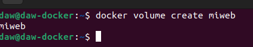

# Ejercicios Docker 3
> Realizado por: Emilio Taibo

## Volúmenes

- Crea un volumen docker que se llame miweb.
~~~
docker volume create miweb
~~~

- Crea un contenedor desde la imagen php:7.4-apache donde montes en el directorio/var/www/html (que sabemos que es el DocumentRoot del servidor que nos ofrece esaimagen) el volumen docker que has creado.

~~~
docker run -d --name php --mount type=volume,src=miweb,dst=miweb,dst=/var/www/html -p 8080:80 php:7.4-apache
~~~

- Utiliza el comando docker cp para copiar un fichero index.html en el directorio/var/www/html.

~~~
docker cp ./index.html php:/var/www/html
~~~

- Accede al contenedor desde el navegador para ver la información ofrecida por el ficheroindex.html.

- Borra el contenedor

~~~
docker stop php
docker rm php
~~~

- Crea un nuevo contenedor y monta el mismo volumen como en el ejercicio anterior.
~~~
docker run -d --name php --mount type=volume,src=miweb,dst=miweb,dst=/var/www/html -p 8080:80 php:7.4-apache
~~~

-  Accede al contenedor desde el navegador para ver la información ofrecida por el ficheroindex.html. ¿Seguía existiendo ese fichero?

Si sigue existiendo

## Bind mount

- Crea un directorio en tu host y dentro crea un fichero index.html.

- Crea un contenedor desde la imagen php:7.4-apache donde montes en el directorio/var/www/html el directorio que has creado por medio de bind mount.

-  Accede al contenedor desde el navegador para ver la información ofrecida por el ficheroindex.html.

- Modifica el contenido del fichero index.html en tu host y comprueba que al refrescar lapágina ofrecida por el contenedor, el contenido ha cambiado.

-  Borra el contenedor

- Crea un nuevo contenedor y monta el mismo directorio como en el ejercicio anterior.

- Accede al contenedor desde el navegador para ver la información ofrecida por el ficheroindex.html. ¿Se sigue viendo el mismo contenido?

- 
