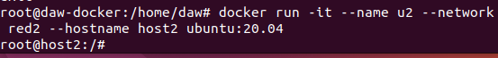
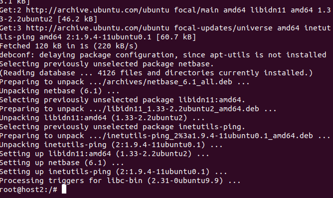
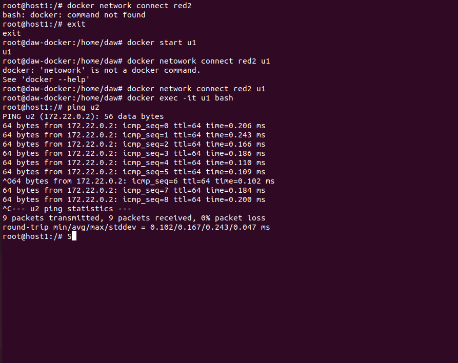

# Ejercicios Docker 4
> Realizado por: Emilio Taibo

- Vamos a crear dos redes de ese tipo (BRIDGE) con los siguientes datos:

Red1:
- Nombre: red1
- Dirección de red: 172.28.0.0
- Máscara de red: 255.255.0.0
- Gateway: 172.28.0.1

Red2:
- Nombre: red2
- Es resto de los datos será proporcionados automáticamente por Docker
~~~
docker network create red1 --subnet 172.28.0.0/16 --gateway 172.28.0.1
docker network create red2

~~~

- Poner en ejecución un contenedor de la imagen ubuntu:20.04 que tenga como hostname
host1 , como IP 172.28.0.10 y que esté conectado a la red1. Lo llamaremos u1 .
~~~
docker run -it --name u1 --network red1 --hostname host1 --ip 172.28.0.10 ubuntu:20.04 
~~~

-  Entrar en ese contenedor e instalar la aplicación ping ( apt update && apt install
inetutils-ping ).
~~~
    docker start u1
    docker excec -it u1 bash
    apt update
    apt install inetutils-ping
~~~

-  Poner en ejecución un contenedor de la imagen ubuntu:20.04 que tenga como hostname
host2 y que esté conectado a la red2. En este caso será docker el que le de una IP correspondiente
a esa red. Lo llamaremos u2 .
~~~
docker run -it --name u2 --network red2 --hostname host2 ubuntu:20.04
~~~

- Entrar en ese contenedor e instalar la aplicación ping ( apt update && apt install
inetutils-ping ).
~~~
    docker start u2
    docker excec -it u2 bash
    apt update
    apt install inetutils-ping
~~~

- Contenedor u1

- Contenedor u2

- Pantallazo donde desde cualquiera de los dos contenedores se pueda ver que no podemos hacer ping al
otro ni por ip ni por nombre

- Pantallazo donde se pueda comprobar que si conectamos el contenedor u1 a la red2 (con docker
network connect ), desde el contenedor u1, tenemos acceso al contenedor u2 mediante ping, tanto
por nombre como por ip.

